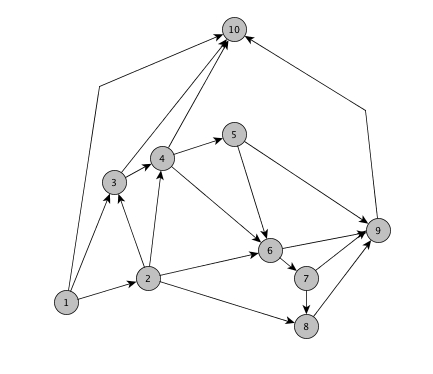
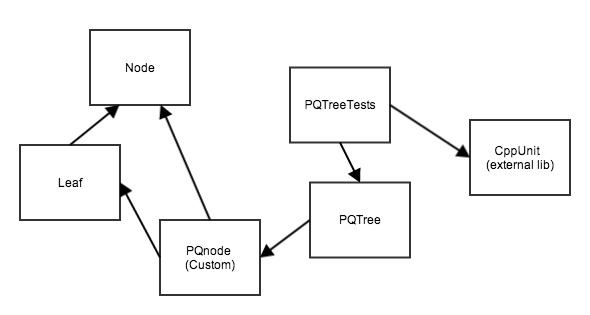

#PQ-Trees

This is an implementation of Booth and Leuker's (1) PQTree datastructure as described by Young (2). It should be noted that while the rules outlined for the PQTree trees were followed a large degree of creativity was used in implementing them

##What is a PQ Tree?

A PQ-Tree is a datastructure used in representing all permutations allowed on a given base set, U. The members of the base set are the leaves in the tree and the q-nodes and p-nodes are used in representing the different constraints we wish to apply. children of a p-node must be grouped under that node but their child elements may be permuted randomly with respect to one another. The q-node is more restrictive. Child elements of a q-node may only be reversed.

PQTRee Expressions:

    pnode   - { }
    qnode   - [ ]
    leaf    - any integer

**Figure 1. Example PQTree. Can be represented by the expression: { 5 1 3 [ 3 {2 4 } [ { 4 5 } 6 2 ] ] }**
    
###PQTree class

####PQTree()

    default constructor
    
####PQTree(string const)

    non-default constructor. Initializes the PQTree from a valid PQTree expression

####PQTree(vector\<int>)

    non-default constructor. Initializes the PQTree with a universal tree based on the 
    set of values in the input vector
####string print_expression(bool)

    return an expression string corresponding to the current tree structure
####list<int> reduce\_and_replace(int, vector\<int>)

    performs reductions on the tree based on the input vector. after reduction. replaces 
    the full leaves with the new universal tree that was built from the input vector. 
    returns an empty list if the tree is irreducible. Otherwise, the list returned is the 
    list of sources for the replaced full nodes which will be useful in producing the 
    embedding after testing planarity
####bool set\_consecutive(vector\<int>)

    Performs reductions on the tree based on the input vector. does not add or remove any 
    leaves from the tree
    returns false if the tree is irreducible
####bool equivalent(PQTree&)

    Compares two trees to see if they are equivalent. Trees are equivalent if they impose 
    the same set of restaints. returns true if the trees are equivalent, false otherwise

##How to use this implementation?
####Example: Testing Planarity of an st-numbered input graph from the adjacnecy list

    //adjacency matrix of an st-numbered input graph
    std::vector< std::vector<int> > adj2 =
    {
        {2, 3, 10}, //1
        {3, 6, 8},  //2
        {4, 10},    //3
        {5, 6, 10}, //4
        {6, 9},     //5
        {7, 9},     //6
        {8, 9},     //7
        {9},        //8
        {10},       //9
    };
        
    PQTree tree2(adj2[0], 1);
        
    for(size_t i=1; i<adj2.size(); i++)
    {
        int curr = (int)(i+1);
        std::vector<int> v = adj2[i];
        std::list<int> srcs = tree2.reduce_and_replace(curr, v); //this is the lists we will use to produce the embedding
        
        if(srcs.empty())
        {
            fprintf(stderr, "error in building the and reducing the tree\n");
            return false;
        }
    }
    return true;
        
####Example: Testing Consecutive ones 

    std::vector< std::vector<int> > mat =
    {
        {2, 3, 4}, //values that are one in our matrix
        {1, 2, 3},
        {4, 5},
        {2, 3},
        {3, 4},
        {1},
        {5}
    };
    PQTree tree("{1, 2, 3, 4, 5}");
        
    for(size_t i=0; i<mat.size(); ++i)
    {
        if(!tree.set_consecutive(mat[i]))
        {
            return false;
        }
    }
    return true;

##File structure and class dependency

**Figure 2. Parent Node class of Leaf and PQnode is abstract, a namespace custom is declared within the PQnode file which contains mainly testing and utility functions or custom string comparision functions. The testing file PQTree tests is dependant on the externally linked library CppUnit ( http://cppunit.sourceforge.net/doc/lastest/index.html )**

To use the PQTree implementation you only need to #include the PQTree.h header file

##References:

1. Booth, K.S., Lueker, G.S.: Testing for the consecutive ones property, interval graphs, and graph planarity using PQ-tree algorithms. J. Comput. Syst. Sci. 13, 335–379 (1976).
2. Young, S.M.: Implementation of PQ-tree algorithms, (1977).

##Notes:

1. This software is distributed without any warranty or guarantee and is currently in development. If you come across any bugs or errors be sure to let me know :)
2. The provided makefile is for unix/linux and compiles with the testing script and you must have cppunit installed for this to work. 
3. This uses C++11. So be sure to use the approriate flags when compiling with your own project
4. There are some GCC warnings turned off with pre-processor statments in the header files ( i.e. for padding structures and c++11 specific features). Just delete the #pragma lines to turn these back on
