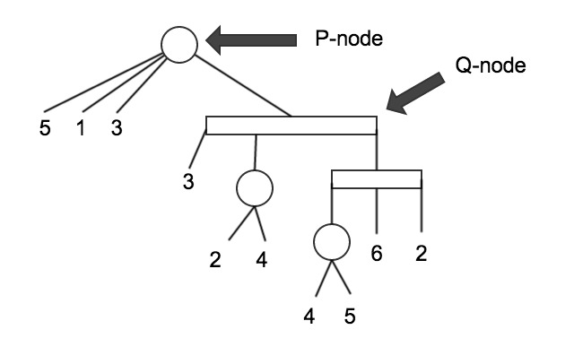

pq-trees
========

Implementation of Booth and Leuker's (1976) PQTree datastructure as described by Young (1977)

Currently in progress of development. Implementation is correct as per unit tests. However, while it should be linear time since the implemetation was based on a linear time algorithm a rigourous time analysis is still to be done

How to use?

provided you are working on a unix or linux system, pull the files and use the makefile to compile

PQTrees can be contructed 3 ways:

    PQTree():           empty
    PQTree(string):     from an valid expression string
    PQTree(vector);     from an initial set of values to make a universal tree
    
PQTRee Expressions:

    pnode - { }
    qnode - [ ]
    leaf - any integer

Figure 1. Example PQTree. Can be represented by the expression: { 5 1 3 [ 3 {2 4 } [ { 4 5 } 6 2 ] ] }
    
Ways to use the trees?

useful in finding interval graphs by applying the set_consecutive(vector) function
useful in testing planarity using the reduce_and_replace(int, vector)

